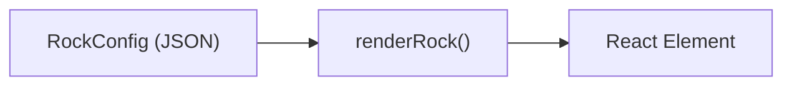
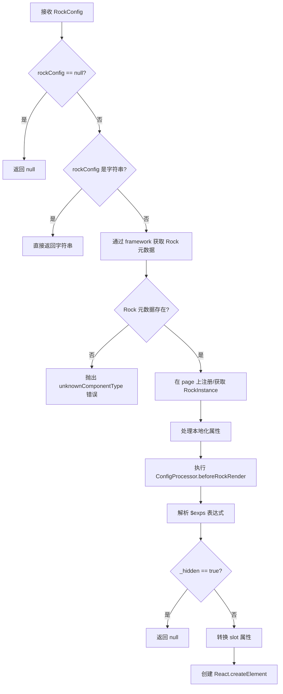

# renderRock 函数使用文档

## 概述

renderRock 是 RUI 框架中 **核心的组件渲染函数**，定义在 `@ruiapp/react-renderer` 包中。它将一个 RockConfig（组件的声明式配置）解析并渲染为 React 元素。

在 RUI 框架中，所有 UI 组件被称为 **Rock**。每个 Rock 通过一个 JSON 配置对象（RockConfig）来描述。renderRock 负责将这些配置对象转化为真正的 React 组件树。



---

## 导入方式

```typescript
import { renderRock, renderRockChildren, renderRockSlot, toRenderRockSlot } from "@ruiapp/react-renderer";
```

---

## 核心函数

### renderRock

将单个 RockConfig 渲染为 React 元素。

#### 函数签名

```typescript
function renderRock(options: RenderRockOptions): React.ReactElement | null;
```

#### 参数类型 RenderRockOptions

| 参数         | 类型                  | 必填 | 说明                                                          |
| ------------ | --------------------- | ---- | ------------------------------------------------------------- |
| `context`    | RockInstanceContext   | 是   | 渲染上下文，包含 framework、page、scope 等                    |
| `rockConfig` | RockConfig            | 是   | 组件的声明式配置对象                                          |
| `expVars`    | `Record<string, any>` | 否   | 表达式变量，用于 `$exps` 表达式求值                           |
| `fixedProps` | `any`                 | 否   | 固定属性，会被合并到 rockConfig 上（常用于传递 `$slot` 数据） |

#### 执行流程



**各步骤说明：**

1. **空值检查** — 如果 `rockConfig` 为 `null` 或 `undefined`，函数直接返回 `null`，不执行后续逻辑。
2. **字符串处理** — 如果 `rockConfig` 是字符串类型（纯文本节点），直接将其作为 React 文本节点返回，无需创建组件实例。
3. **获取 Rock 元数据** — 通过 `framework.getComponent(rockConfig.$type)` 从已注册的组件库中查找对应的 Rock 元数据。如果未找到，抛出 `unknownComponentType` 错误。
4. **组件实例管理** — 调用 `page.getComponentById()` 获取已有组件实例，如果不存在则通过 `page.addComponents()` 创建新实例并附加到页面上。组件实例用于维护组件的状态和生命周期。
5. **本地化配置** — 处理组件配置中的国际化属性，根据当前语言环境将相应的翻译值应用到组件属性上。
6. **配置处理器** — 执行所有注册的 `ConfigProcessor` 的 `beforeRockRender` 钩子。这允许外部插件在渲染前对组件配置进行修改或增强。
7. **表达式解析** — 解析 `$exps` 中定义的动态表达式。表达式可以引用 `$scope.vars`、`$slot` 等上下文变量，结合 `expVars` 参数提供的额外变量进行求值，并将结果赋值到对应的属性上。
8. **隐藏检查** — 如果解析后的属性中 `_hidden` 为 `true`，函数返回 `null`，该组件不会被渲染到界面上。
9. **插槽转换** — 遍历 Rock 元数据中定义的 `slots`，将组件配置中对应的插槽属性通过 `toRenderRockSlot` 转换为 React 可用的渲染函数。
10. **创建 React 元素** — 使用 `React.createElement` 创建最终的 React 元素，将处理后的所有属性传递给 `ComponentRenderer` 进行渲染。

#### 基本用法

在 Rock 的 Renderer 函数中渲染子组件：

```typescript
import { Rock } from "@ruiapp/move-style";
import { renderRock } from "@ruiapp/react-renderer";

export default {
  $type: "myComponent",

  Renderer(context, props, state) {
    return renderRock({
      context,
      rockConfig: {
        $type: "antdButton",
        $id: `${props.$id}-btn`,
        label: "点击我",
        onClick: {
          $action: "script",
          script: () => {
            console.log("clicked");
          },
        },
      },
    });
  },
} as Rock;
```

> [!IMPORTANT] > `rockConfig` 中的 `$id` 必须在整个 Page 范围内唯一。建议使用父组件的 `props.$id` 作为前缀来生成子组件 ID。

#### 渲染带有丰富属性的组件

```typescript
Renderer(context, props, state) {
  return renderRock({
    context,
    rockConfig: {
      $type: "editableTable",
      $id: `${props.$id}-table`,
      width: 300,
      columns: [
        { name: "name", title: "姓名", width: 150 },
        { name: "team.name", title: "小组", control: "input", width: 150 },
      ],
      onChange: (v) => { /* 处理变更 */ },
    },
  });
},
```

#### 用于页面布局渲染

```typescript
function renderPageWithLayout(context: RockInstanceContext, pageConfig: PageConfig) {
  const rockConfig: RockConfig = {
    $id: "$layout",
    $type: "component",
    component: {
      view: pageConfig.layout.view,
    },
    children: pageConfig.view,
  };
  return renderRock({ context, rockConfig });
}
```

---

### renderRockChildren

渲染一组子组件配置（可以是单个 RockConfig、数组、或函数）。

#### 函数签名

```typescript
function renderRockChildren(options: RenderRockChildrenOptions): React.ReactElement | React.ReactElement[] | null;
```

#### 参数类型 RenderRockChildrenOptions

| 参数                 | 类型                  | 必填 | 说明                                                    |
| -------------------- | --------------------- | ---- | ------------------------------------------------------- |
| `context`            | RockInstanceContext   | 是   | 渲染上下文                                              |
| `rockChildrenConfig` | RockChildrenConfig    | 是   | 子组件配置，类型为 `RockConfig \| RockConfig[] \| null` |
| `expVars`            | `Record<string, any>` | 否   | 表达式变量                                              |
| `fixedProps`         | `any`                 | 否   | 固定属性                                                |

#### 内部逻辑

- 数组：逐个调用 renderRock 并返回数组
- 函数：直接调用该函数，传入 `{ context, expVars, fixedProps }`
- 单个对象：调用 renderRock 渲染

#### 使用示例

**渲染容器组件的子组件：**

```typescript
export default {
  $type: "myContainer",

  Renderer(context, props: ContainerRockConfig) {
    return (
      <div style={props.style}>
        {renderRockChildren({
          context,
          rockChildrenConfig: props.children,
          fixedProps: {
            $slot: props.$slot,
          },
        })}
      </div>
    );
  },
} as Rock;
```

**条件渲染（Show 组件模式）：**

```typescript
export default {
  $type: "show",

  Renderer(context, props: ShowProps) {
    const children = props.when ? props.children : props.fallback;

    return renderRockChildren({
      context,
      rockChildrenConfig: children,
      fixedProps: { $slot: props.$slot },
    });
  },
} as Rock;
```

**在原生 HTML 元素中渲染子组件：**

```typescript
Renderer: (context, props: HtmlElementProps) => {
  return React.createElement(
    props.htmlTag,
    { style: props.style },
    props.children
      ? renderRockChildren({
          context,
          rockChildrenConfig: props.children,
          expVars: { $slot: props.$slot },
          fixedProps: { $slot: props.$slot },
        })
      : null,
  );
},
```

---

### renderRockSlot

渲染一个具名 Slot 的内容。会自动查找 Rock 元数据中的 Slot 定义，并按照其配置处理参数映射。

#### 函数签名

```typescript
function renderRockSlot(options: RenderRockSlotOptions): React.ReactElement | React.ReactElement[] | null;
```

#### 参数类型

| 参数           | 类型                | 必填 | 说明                                             |
| -------------- | ------------------- | ---- | ------------------------------------------------ |
| `context`      | RockInstanceContext | 是   | 渲染上下文                                       |
| `slot`         | RockChildrenConfig  | 是   | Slot 内的组件配置                                |
| `rockType`     | `string`            | 是   | 所属 Rock 的类型名                               |
| `slotPropName` | `string`            | 是   | Slot 的属性名称                                  |
| `args`         | `any[]`             | 是   | 传给 Slot 的参数（用于 `argumentsToProps` 映射） |
| `fixedProps`   | `any`               | 否   | 固定属性                                         |

#### 使用示例

```typescript
Renderer: (context, props: SlotProps) => {
  const slotConfig = context.component[props.slotName];

  return renderRockSlot({
    context,
    slot: slotConfig,
    slotPropName: props.slotName,
    rockType: "slot",
    args: [],
    fixedProps: { $slot: props.$slot },
  });
},
```

---

### toRenderRockSlot

将 Slot 配置转化为一个 **渲染函数**（render prop 模式），延迟渲染 Slot 内容。适用于需要将 Slot 作为回调传递给第三方组件的场景。

#### 函数签名

```typescript
function toRenderRockSlot(options: GenerateRockSlotRendererOptions): ((...args: any[]) => React.ReactElement) | null;
```

#### 参数类型

| 参数           | 类型                | 必填 | 说明               |
| -------------- | ------------------- | ---- | ------------------ |
| `context`      | RockInstanceContext | 是   | 渲染上下文         |
| `slot`         | RockChildrenConfig  | 是   | Slot 内的组件配置  |
| `rockType`     | `string`            | 是   | 所属 Rock 的类型名 |
| `slotPropName` | `string`            | 是   | Slot 的属性名称    |
| `fixedProps`   | `any`               | 否   | 固定属性           |

---

## 关键类型说明

### RockInstanceContext

渲染上下文，在 Rock 的 Renderer 函数中作为第一个参数传入。

```typescript
type RockInstanceContext = {
  framework: Framework; // 框架实例，提供组件注册、日志等能力
  page: Page; // 当前页面实例
  scope: Scope; // 当前作用域
  component?: RockInstance; // 宿主组件实例（声明式组件中可用）
  logger: RuiRockLogger; // Rock 专用日志器
};
```

### RockConfig

组件的声明式配置对象，核心字段：

```typescript
type RockConfigBase = {
  $id?: string; // 组件唯一标识
  $type: string; // 组件类型名（对应 Rock 的 $type）
  $version?: string; // 版本号
  $name?: string; // 组件名称
  $description?: string; // 描述信息
  $exps?: RockExpsConfig; // 表达式配置，动态计算属性值
  _hidden?: boolean; // 是否隐藏组件
};
```

> [!NOTE]
> RockConfig 是联合类型，包含 SimpleRockConfig、RockWithSlotsConfig、ContainerRockConfig 和 RouterRockConfig，分别适用于不同类型的组件。

### RockChildrenConfig

子组件配置的类型，可以是：

```typescript
type RockChildrenConfig = RockConfig | RockConfig[] | null;
```

---

## 常用辅助函数

### convertToEventHandlers

将 RockConfig 中以 on 开头的事件属性转换为可执行的事件处理函数。

```typescript
import { convertToEventHandlers } from "@ruiapp/react-renderer";

Renderer: (context, props) => {
  const eventHandlers = convertToEventHandlers({ context, rockConfig: props });
  return <div {...eventHandlers}>内容</div>;
},
```

---

## 使用模式总结

| 场景                  | 推荐函数           | 说明                                  |
| --------------------- | ------------------ | ------------------------------------- |
| 渲染单个子组件        | renderRock         | 传入完整的 RockConfig                 |
| 渲染 `children` 属性  | renderRockChildren | 处理数组和单个配置                    |
| 渲染具名 Slot         | renderRockSlot     | 需要指定 `rockType` 和 `slotPropName` |
| 生成 render prop 回调 | toRenderRockSlot   | 返回函数而非直接渲染                  |
| 在 JSX 中混合原生元素 | renderRockChildren | 作为原生元素的 children               |

---

## 完整 Rock 组件示例

以下示例展示了一个组件树 Rock，在 Renderer 中构建 RockConfig 并使用 renderRock 渲染：

```typescript
import { Rock, RockConfig, RockEventHandlerScript } from "@ruiapp/move-style";
import { renderRock } from "@ruiapp/react-renderer";

export default {
  $type: "myTreeView",

  Renderer(context, props) {
    const { framework, page } = context;

    const rockConfig: RockConfig = {
      $id: `${props.$id}-internal`,
      $type: "antdTree",
      fieldNames: { key: "$id", title: "label" },
      defaultExpandAll: true,
      treeData: props.treeData,
      selectedKeys: props.selectedKeys,
      style: props.style,
      onSelect: {
        $action: "script",
        script: (event) => {
          const [selectedKeys] = event.args;
          console.log("Selected:", selectedKeys);
        },
      } as RockEventHandlerScript,
    };

    return renderRock({ context, rockConfig });
  },
} as Rock;
```

---

## 注意事项

> [!WARNING]
>
> - `rockConfig.$id` 在同一 Page 内必须唯一，否则会导致组件状态混乱。
> - renderRock 返回 `null` 的情况：传入 `null`/`undefined`，或组件设置了 `_hidden: true`。
> - 如果 `$type` 对应的 Rock 未在 Framework 中注册，会抛出 `unknownComponentType` 错误。

> [!TIP]
>
> - 在容器类组件中，记得通过 `fixedProps` 传递 `$slot` 数据，确保子组件可以访问 Slot 上下文。
> - 使用 `$exps` 配合 `expVars` 可以实现属性的动态绑定，例如 `$exps: { "title": "$scope.vars.pageTitle" }`。
